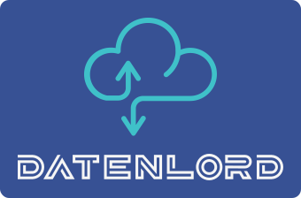

# DatenLord

----
*DatenLord* is a next-generation cloud-native distributed storage system, which aims to be application-orientated software-defined storage (SDS) platform. On one hand, DatenLord is designed as a cloud-native storage system, which itself is distributed, fault-tolerant, and graceful hot-upgrade. These cloud-native features make DatenLord easy to use and easy to maintain. On the other hand, DatenLord is designed as an application-orientated storage system, which is called "Computing Defined Storage", in that DatenLord is optimized for many application scenarios, such as databases, big data, AI machine learning, and especially container ecosystems. DatenLord provides high-performance storage service for containers, which facilitates stateful applications running on top of Kubernetes (K8S). The high performance achieved by, DatenLord is by leveraging the most recent technological revolution in hardware and software, such as NVMe, non-volatile memory, asynchronous programming, and the native Linux asynchronous IO support. 

Why do we build DatenLord? The reason is two-fold:
* Firstly, the recent computer hardware architecture revolution stimulates storage software refractory.  The mainstream SDS systems haven't changed much in recent 10 years, and at that time hard-disk drive (HDD) was the main storage device. Nowadays, solid-state drive (SSD) become the mainstream, not to mention the most advanced SSD, NVMe and non-volatile memory. The performance of storage devices becomes hundreds of times faster than before, that the HDD latency is around 1~10 ms, whereas the SSD latency is around 50–150 μs, NVMe latency is around 25 μs, and non-volatile memory latency is 350 ns. With the storage performance revolution, traditional blocking-style/synchronous IO becomes very inefficient, and non-blocking-style/asynchronous IO is booming, such as the recent Linux kernel has built native-asynchronized IO mechanism, io_uring. Moreover, context switch overhead becomes no more negligible, w.r.t. SSD latency. Many modern programming languages have proposed asynchronized programming, green thread or coroutine to manage asynchronous IO tasks, so as to avoid context switch overhead introduced by blocking-style/synchronous IO. Therefore we think it’s time to build a next-generation SDS system that takes advantage of the storage performance revolution as far as possible, by leveraging non-blocking/asynchronous IO, asynchronized programming, NVMe, and even non-volatile memory.

* Secondly, most existing IT systems are computing and storage isolated, that applications and storage systems had their dedicated clusters, respectively. This isolated architecture is no longer feasible, in that nowadays, applications are dealing with much larger data than ever before. One notorious example is that an AI training job takes one hour to load training data whereas the training job itself finishes in only 45 minutes. Therefore, isolating computing and storage makes the whole system very inefficient, as transferring data between applications and storage systems wastes much time. We propose a more efficient computing and storage coupled architecture, which schedules jobs closer to data, so as to reduce data transfer overhead and improve data processing efficiency, exactly as HDFS does, except HDFS is dedicated for Hadoop, whereas DatenLord is more for container ecosystems.

----

## Architecture

DatenLord is of classical master-slave architecture. To achieve better storage performance, DatenLord has a coupled architecture with K8S, that DatenLord can be deployed within a K8S cluster, in order to leverage data locality to speed up data access. The above figure is the overall DatenLord architecture, the green parts are DatenLord components, the blue parts are K8S components, the yellow part represents containerized applications. There are several major components of DatenLord: master node (marked as Daten Lord), slave node (marked as Daten Sklavin), and K8S plugins.

The master node has three parts: S3 compatible interface (S3I), Lord, and Meta Storage Engine (MSE). S3I provides a convenient way to read and write data in DatenLord via S3 protocol, especially for bulk upload and download scenarios, e.g. uploading large amounts of data for big data batch jobs or AI machine learning training jobs. Lord is the overall controller of DatenLord, which controls all the internal behaviours of DatenLord, such as where and how to write data, synchronize data, etc. MSE stores all the meta information of DatenLord, such as the file paths of all the data stored in each slave node, the user-defined labels of each data file, etc. MSE is similar to HDFS namenode.

The slave node has four parts: Data Storage Engine (DSE), Sklavin, Meta Storage Engine (MSE), S3/P2P interface. DSE is in charge of communicating with kernel modules so as to read/write data from/to memory or disks. More specifically, DatenLord sets up a filesystem in userspace (FUSE) in a slave node by using the FUSE driver and library. DSE is to implement the FUSE, executing all the underlying FUSE operations, such as open, create, read, and write, etc. DSE can implement different types of FUSE for different scenarios, e.g., memory-based FUSE, disk-based FUSE, and SAN-based FUSE, etc. Sklavin is to communicate with the Lord of the master node and handle the requests from the Lord and CSI driver, such as health check report, data synchronization, data consistency inspection, Lord election, etc. The MSE of the slave node is a local copy of the MSE from the master node. S3/P2P interface provides a convenient way, either S3 or P2P, to read, write and synchronize data in a slave node.

The K8S plugins include a container storage interface (CSI) driver and a customer filter. The CSI driver is for DatenLord to work with K8S to manage volumes for container tasks, such as loading a read-only volume, creating a read-write volume. The customer filter is to help K8S to schedule tasks to data nearby based on the meta-information in MSE of the master node.

## DatenLord Optimization Strategy

In general, there are two kinds of storage needs from an application perspective: one is latency-sensitive, and the other is throughput-sensitive. As for latency-sensitive applications, such as database applications, like MySQL, MongoDB, and ElasticSearch, etc, their performance relies on how fast a single I/O-request got handled. As for throughput-sensitive applications, such as big data and AI machine learning jobs, like Spark, Hadoop, and TensorFlow, etc, the more data load per unit time, the better their performance.

DatenLord is crafted to fit the aforementioned two scenarios. Specifically, to reduce latency, DatenLord caches in memory as much data as possible, in order to minimize disk access; to improve throughput (we focus on reading throughput currently), DatenLord, on one hand, prefetches data in memory to speed up access, on the other hand, leverages K8S to schedule tasks to data nearby, so as to minimize data transfer cost.

## Target Usage Scenarios

DatenLord has several target scenarios, which fall into two main categories:
* Latency-sensitive cases, that DatenLord will coordinate with K8S to schedule containers close to data to minimize latency:
    * Containerized applications, especially stateful applications;
    * Serverless, Lambda, FaaS, etc, event-driven tasks;
* Throughput-sensitive cases, that DatenLord will pre-load remote data into local clusters to speed up access:
    * AI and big-data jobs, especially training tasks;
    * Multi-cloud storage unified management, to facilitate application migration across clouds.

## Road Map

