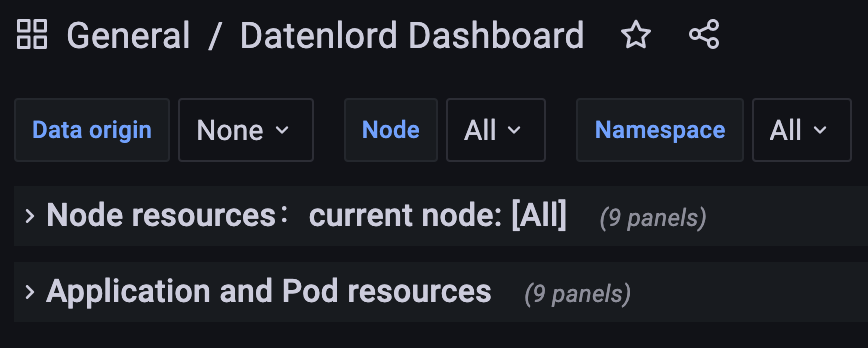
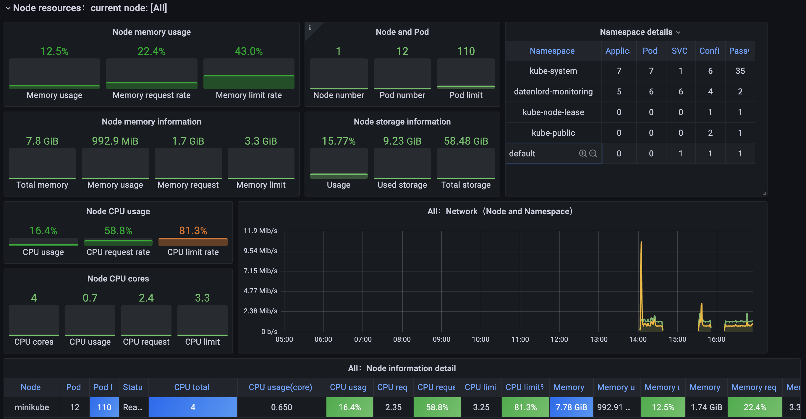
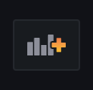
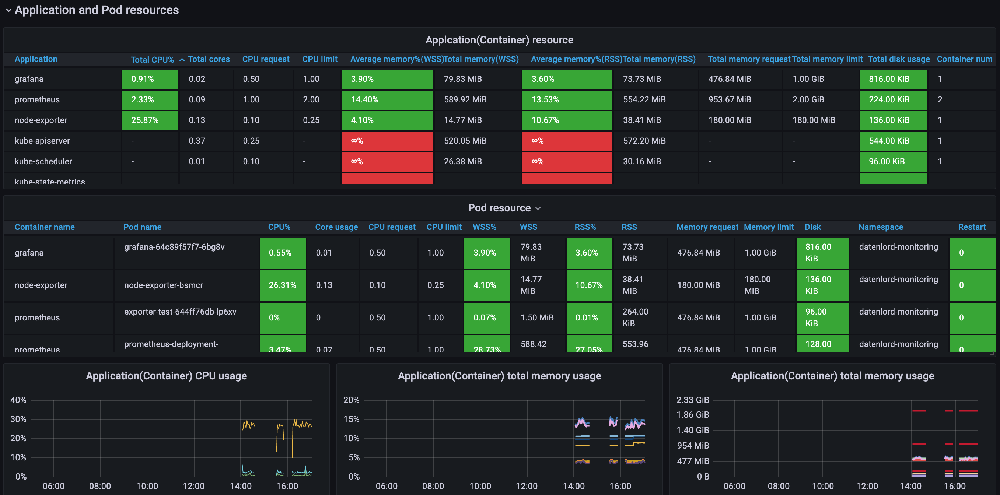
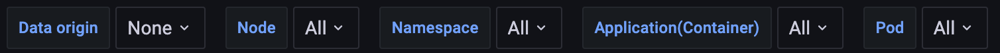

# Datenlord dashboard

Datenlord is using Grafana dashboard to show all the metrics, which can be configed dynamically to display different information.

Currently Datenlord has two dashboards. `Node resources` and `Application and Pod resources`. Both of them have 9 panels currenlty.

### Node resources

All the nodes resources information is displayed in this dashboard, including memory usage, CPU usage, network information, etc. The default data is all nodes resources, you can filter the data to a specific node by clicking the top `Node` button.

Currently it has 9 panels: Node memory usage rate, Node memory usage, Pods number, Node storage information, Namespace details, Node CPU usage rate, Node CPU usage, network and node information details.

To add a new panel, just click the top side `Add Panel` button

Then choose the `Pramethues` as the Data source and input the query to collect the metrics data. 

### Application and Pod resources

All the application, instance and Pod information are displayed in this dashboard.

To display a specifc application's resource information, you can use the top side filter panel:

When you choose a specific application, all the following metrics (tables, charts, guages) will be filtered to only display the resources for this application.