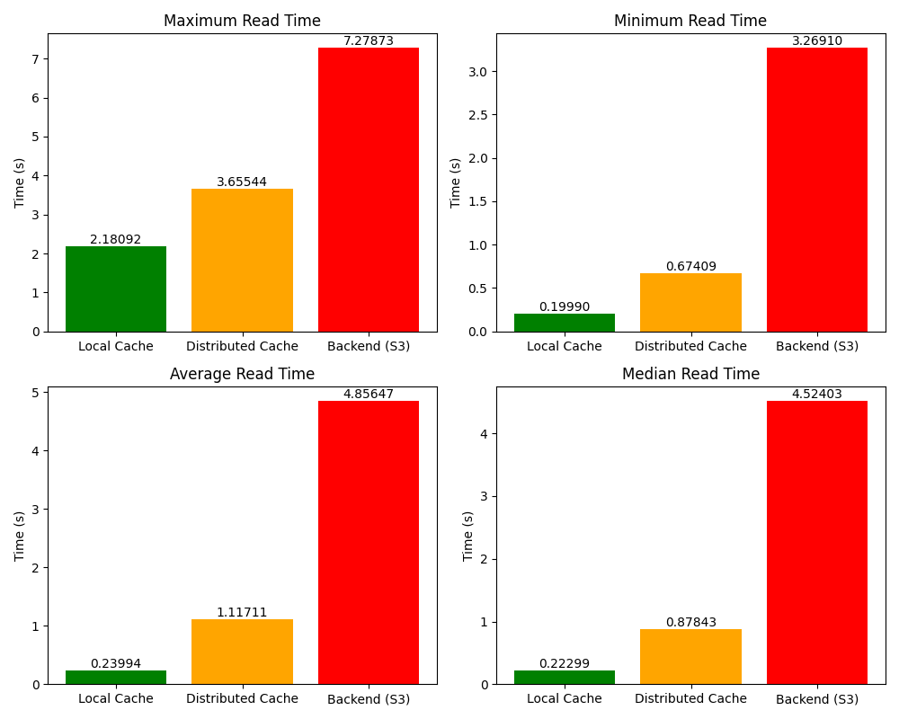
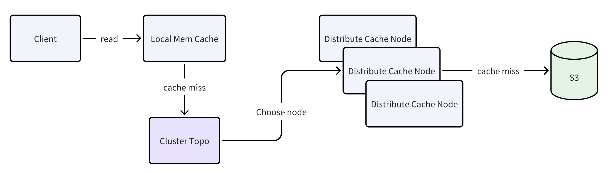

# DatenLord Distribute Cache

## Introduction

Currently DatenLord(commit id: d90fd43732373451207e56e9b9cd7eef9e7b53e1) supports high performance distributed file read/write capability, and provides a local mem cache on the DatenLord side to accelerate file read and write back, but when a large number of However, when a large number of client/reasoning nodes repeatedly access a certain large file, the backend may become a bottleneck of read performance, so we consider supporting a set of distributed cache to help all DatenLord nodes can share a batch of cache, thus reducing the pressure on the backend.

DatenLord Distribute Cache is a high-performance distributed caching system designed for large file read scenarios to improve data access latency and overall system performance. This document provides an overview of the system's features, benchmark results, deployment notes, basic architectural design, current latency overhead, and future plans.

## Benchmark

Let's take a simple example as a demonstration of our performance benchmarking results, where we compare the performance of reading large files for pure in-memory caching, pure distributed caching, and pure Backend (S3) scenarios.

We choose one of the cases for benchmarking:
1. 200MB file reading scenario, in order to simulate the scenario of reading a large file (more than 2GB, block size of 8-64MB), we turn on a 512KB block size in FUSE and read a 200MB file.
2. Mount the local DatenLord node, the local Distribute Cache node, and the local MinIO S3 node in FUSE as the test scenario. 3.
3. Read the file 100/500/1000 times.

The final Benchmark results are shown in the figure below, which shows that our average latency is much closer to the local cache than Backend's, which accelerates the ability to read large files.
max read are in the first load from the backend read data latency, you can see that due to the distributed cache side from the backend read data latency will increase some average latency can be seen median, directly from the distributed cache load will be about 0.6s latency increase, 5-6 times faster than s3!



- TIPS: The above test results may vary depending on the performance of the machine.

## Deployment

### Standalone Deployment

We can complete this test of distributed caching capabilities directly on the local machine to verify the ability of our distributed file cache to accelerate large file read scenarios.

1.	 Prerequest：
Install Docker(24.0.5), Rust(1.74.0)
2.	Start ETCD/MinIO Server

We provide scripts under scripts to quickly start a single-instance node, which you can do directly locally

```bash
bash scripts/setup/setup_etcd.sh
bash scripts/setup/setup_minio.sh
```

3. Compile and start the DatenLord node
```bash
cargo run --release --bin datenlord -- \
--role=node \
--csi-endpoint=unix:///tmp/node.sock \
--csi-worker-port=0 \
--node-name=localhost \
--node-ip=127.0.0.1 \
--csi-driver-name=io.datenlord.csi.plugin \
--mount-path=/path/datenlord_cache \ # Change to your local path
--kv-server-list=127.0.0.1:2379 \
--storage-fs-root=/path/datenlord_backend \ # Change to your local path
--server-port=8800 \
--storage-type=s3 \
--storage-s3-endpoint-url=http://localhost:9000 \
--storage-s3-access-key-id=minioadmin \
--storage-s3-secret-access-key=minioadmin \
--storage-s3-bucket=mybucket \
--storage-mem-cache-write-back \
--log-level=debug \
--storage-mem-cache-capacity=104857600 \
--distribute-cache-bind-ip=127.0.0.1 \
--distribute-cache-bind-port=8801
```

4. Compile and start the Cache node

```bash
cargo run --release --bin datenlord -- \
--role=cache \
--csi-endpoint=unix:///tmp/node.sock \
--csi-worker-port=0 \
--node-name=localhost \
--node-ip=127.0.0.1 \
--csi-driver-name=io.datenlord.csi.plugin \
--mount-path=/path/datenlord_cache \
--kv-server-list=127.0.0.1:2379 \
--storage-fs-root=/path/datenlord_backend \ # Change to your local path
--server-port=8800 \
--storage-type=s3 \
--storage-s3-endpoint-url=http://localhost:9000 \
--storage-s3-access-key-id=minioadmin \
--storage-s3-secret-access-key=minioadmin \
--storage-s3-bucket=mybucket \
--storage-mem-cache-write-back \
--log-level=debug \
--storage-mem-cache-capacity=104857600 \
--distribute-cache-bind-ip=127.0.0.1 \
--distribute-cache-bind-port=8801
```

Then you can read and write files under the mount path.

### Cloud Deployment

TODO

## Design



The deployment cache is mainly composed of the following modules:
1. Cluster Manager, used to manage the node topology of the sub-deployment cache.
2. RPC Server, which handles asynchronous read requests for file blocks.
3. Mem Cache, the block cache on the Cache Node.
4. DatenLord Storage Client, which interfaces with RPC Client, Cluster Manager, and Local Mem Cache.

### Cluster Manager

Aligns with DatenLord's file metadata management service ETCD, and uses ETCD to achieve high availability and consistency maintenance of the cluster. There is a Master node in the cluster that is responsible for unified management of cluster topology, node status in the cluster, and is responsible for updating the hash ring content to ETCD for the Client to obtain. Other Slave nodes will Watch Master node to ensure high availability of the cluster.

### RPC

Designed for the network file IO a set of purely asynchronous RPC protocol , support for asynchronous Ping/FileRequest docking Client and Server side , all Request and Response are running in the same asynchronous environment , and try to reduce the overhead of the RPC protocol itself , you can basically run the full bandwidth of the TCP Stream .

### Mem Cache

Cache Node on the mem cache, and the existing storage mem cache implementation is similar, and DatenLord storage and use the same backend, in the mem to maintain the timestamp and block mapping for memory elimination. Currently, SSD and other secondary caches have not been introduced, but may be unified access in the future.

### DatenLord Storage Client

Currently, it interfaces with the storage design on the Master branch, and adds read_xxx_with_version to eliminate the cache on the Distribute Cache in an inert manner. In addition, the Client side regularly and inertly maintains the current observable cluster topology state.

## Latency Overhead

1. The latency of read_block in distribute cache is not very uniform, in a better case it is around 300-500us, but when testing, we will find that a batch of requests is around 1-2ms, and a few of them will reach 5ms or more.
2. Continuous rpc reads 400 blocks of 512kb, latency is about 160ms, so the remaining 0.5s and above overhead is still to be optimized.

## Future Plans

1. Special optimization for rpc server side jitter
2. Support for K8s deployment
