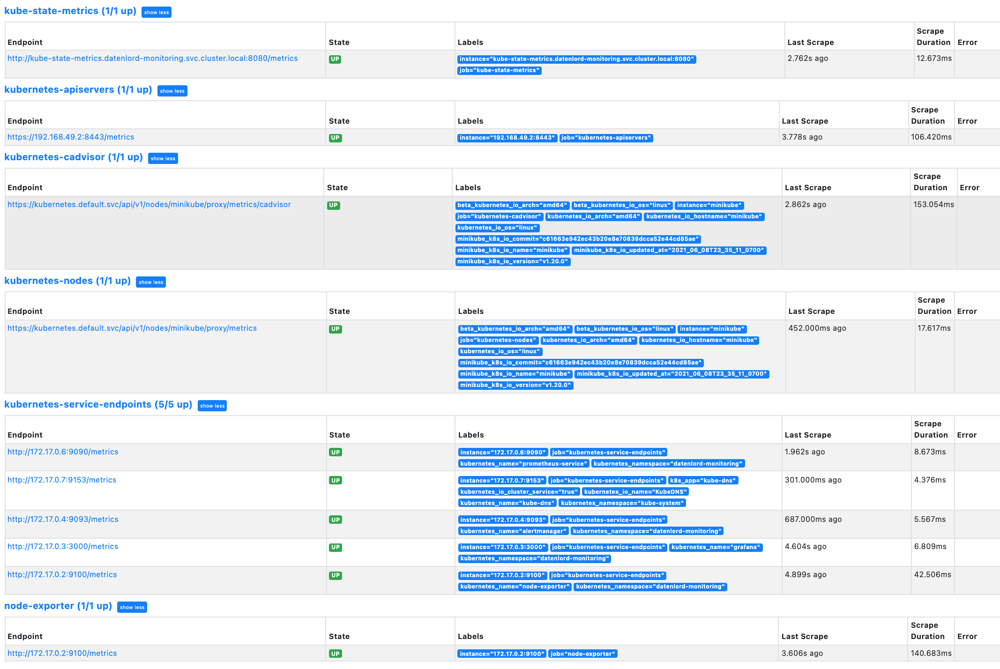
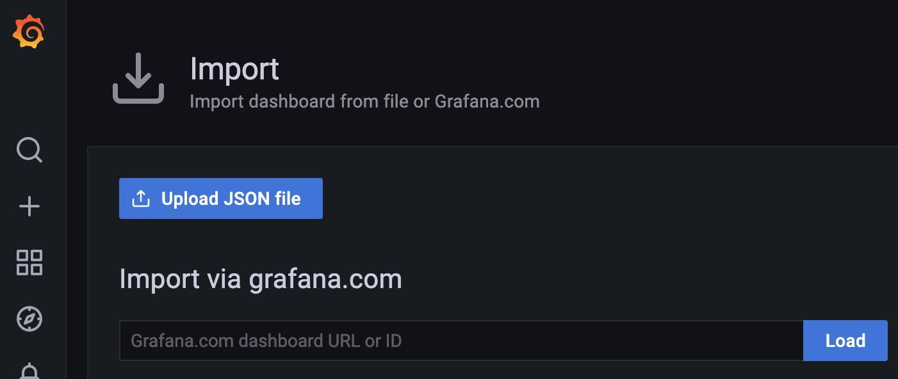
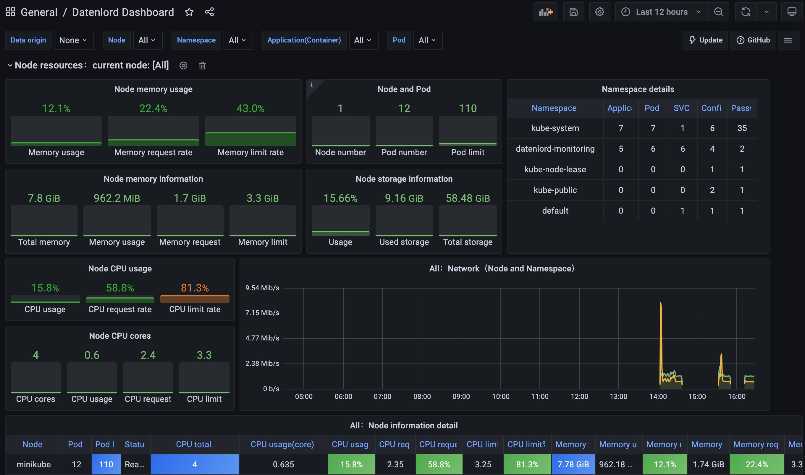
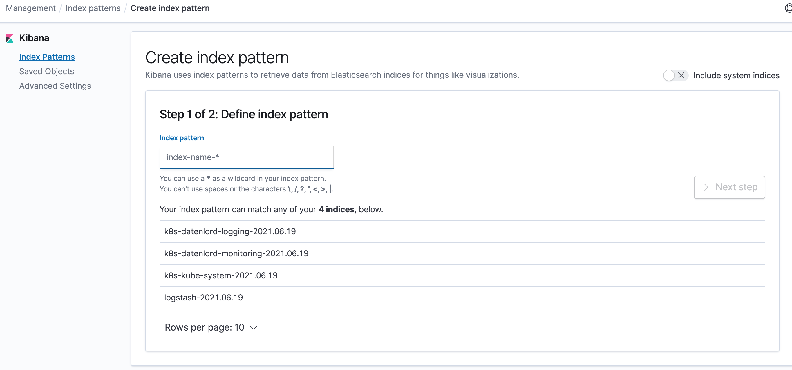

# Datenlord-Monitoring

[Prometheus](https://prometheus.io/) and [Grafana](https://grafana.com/) are used in Datenlord to monitor the whole system's status, as well as to send alerts when the alert rules are triggered.

## Quick start
To quickly start all the things just do this:
```
kubectl apply -f scripts/datenlord-monitor.yaml
```
This will create the namespace `datenlord-monitoring` and bring up all components in there.

To shut down all components again you can just delete that namespace:
```
kubectl delete namespace datenlord-monitoring
```

## Config details
All configurations for Prometheus are part of `datenlord-monitor.yaml` file and are saved as a Kubernetes config map. By externalizing Prometheus configs to a Kubernetes config map, you don’t have to build the Prometheus image whenever you need to add or remove a configuration. You need to update the config map and restart the Prometheus pods to apply the new configuration.

The `prometheus-server-conf` config map contains all the configurations to discover pods and services running in the Kubernetes cluster dynamically. The following scrape jobs are configed in our Prometheus monitor configuration:
* kubernetes-apiservers: It gets all the metrics from the API servers.
* kubernetes-nodes: It collects all the kubernetes node metrics.
* kubernetes-pods: All pods metrics.
* kubernetes-cadvisor: Collects all cAdvisor metrics.
* kubernetes-service-endpoints: All the Service endpoints are scrapped if the service metadata is annotated with prometheus.io/scrape and prometheus.io/port annotations.
* node-exporter: Collects all the Linux system-level metrics of all Kubernetes nodes.

Prometheus main server is deployed as a `Deployment` with one replica.

To access the Prometheus dashboard over a IP or a DNS name, we also expose it as Kubernetes service. Once created, you can access the Prometheus dashboard using any of the Kubernetes nodes IP on port 30000. If you use Minikube, you can also run `minikube service prometheus-service -n datenlord-monitoring`, which will open the Prometheus dashboard page automatically.

Now if you browse to `status -> Targets`, you will see all the Kubernetes endpoints connected to Prometheus as shown below.


`Alert Manager` is also setup in Datenlord Prometheus, which has the following key configurations:
* A config map for AlertManager configuration.
* Alert Manager Kubernetes Deployment.
* Alert Manager service to access the web UI.

Alert receiving configuration is saved in the `alertmanager-config` config map, you can change it to set up your custom alert receiver.

The alerting rules are configed in `prometheus-server-conf` config map.

Grafana server is also deployed as a `Deployment` with one replica, and is configed with prometheus as default data source. If you have more data sources, you can add more data sources with different YAMLs under the `grafana-datasources` config map. The Grafana dashboard is exposed as a Kubernetes service. Once created, you can access the Grafana dashboard using any of the Kubernetes nodes IP on port 32000. If you use Minikube, you can also run `minikube service grafana -n datenlord-monitoring`, which will open the Grafana dashboard page automatically.

Use the following default username and password to log in. Once you log in with default credentials, it will prompt you to change the default password.

```
User: admin
Pass: admin
```
Datenlord has already built a dashboard templates. To use Datenlord dashboard, just import [datanlord_dashboard.json](../scripts/datenlord-e2e-test.yaml) file in Grafana.



Then you will see all the prebuilt dashboards as shown below.


The detail configurations can be found in this [Datenlord Dashboard](docs/datenlord_monitoring.md) doc.

There are also many prebuilt Grafana templates available for Kubernetes. To know more, see [Grafana Kubernetes Dashboard templates](https://grafana.com/grafana/dashboards?search=kuberneteshttps://grafana.com/grafana/dashboards?search=kubernetes)

# Datenlord-logging

Datenlord uses `Elasticsearch`, `Fluentd` and `Kibana` to collect and display all logs from Kubernetes system. Fluentd is able to collect logs both from user applications and cluster components such as kube-apiserver and kube-scheduler, two special nodes in the k8s cluster. As with fluentd, ElasticSearch can perform many tasks, all of them centered around storing and searching. Kibana is a useful visualization software that helps with data demonstration.

## Quick start
To quickly start all the things just do this:
```
kubectl apply -f scripts/datenlord-logging.yaml
```
This will create the namespace `datenlord-logging` and bring up all components in there.

To shut down all components again you can just delete that namespace:
```
kubectl delete namespace datenlord-logging
```

## Config details

Elasticsearch is deployed as a `Deployment` with `emptyDir` storage volume. You can also change it to your own PVC for persistent storage.

As the fluentd needs to keep all the logs from the cluster, it has to be installed in all nodes. So it is deployed as a `DaemonSet`. All the configurations are stored in the `fluentd-es-config` config map, which has the following key setup:
* Filters to discard useless logs.
* Input sources to control where to collect logs.
* Output configuration to set Elasticsearch as the destination.

Kibana is already configed with Elasticsearch as its default data source, and is exposed as a Kubernetes service. Once created, you can access the Kibana dashboard using any of the Kubernetes nodes IP on port 32001. If you use Minikube, you can also run `minikube service kibana -n datenlord-logging`, which will open the Kibana dashboard automatically.

Then you can create any index pattern under the `Index Patterns` page.

